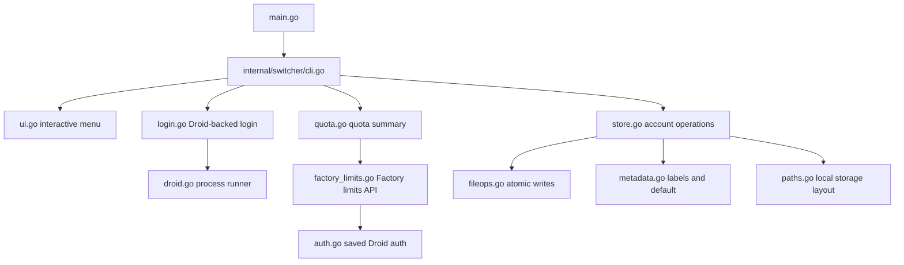

# Architecture

Last verified: 2026-07-24

## Purpose

`droid-switcher` is a small Go CLI that manages multiple Factory Droid logins without reimplementing Droid authentication. It delegates login to the installed `droid` binary, stores each account in an isolated Factory home, and swaps only the auth files that Droid already expects in `~/.factory`.

## Key Files

| File | Role |
|------|------|
| `main.go` | Thin process entry point that delegates all behavior to the switcher package |
| `internal/switcher/cli.go` | Top-level command routing, flag parsing, list/current rendering, and help text |
| `internal/switcher/ui.go` | No-argument interactive home screen and guided menu flows |
| `internal/switcher/store.go` | Account persistence, switch operations, labels/defaults, and active-account tracking |
| `internal/switcher/login.go` | Droid-auth-backed login flow using isolated Factory homes |
| `internal/switcher/droid.go` | Process runner that launches `droid` with `FACTORY_HOME_OVERRIDE` |
| `internal/switcher/auth.go` | Droid encrypted-auth reader/writer used for quota token refresh |
| `internal/switcher/factory_limits.go` | Factory limits API client and quota-window mapping |
| `internal/switcher/quota.go` | Quota account resolution and report rendering |
| `internal/switcher/metadata.go` | Label/default-account metadata persisted alongside saved accounts |
| `internal/switcher/fileops.go` | Atomic file writes and copies for auth and metadata state |
| `internal/switcher/version.go` | Build-time version surface for the CLI |
| `Makefile` | Shared build, test, static-analysis, vulnerability-scan, and install entry points |
| `.github/workflows/ci.yml` | Remote test, lint, and vulnerability quality gates |

## Flow / How It Works

The entry point intentionally stays thin. `main.go` calls `switcher.Run`, and `internal/switcher/cli.go` decides whether to enter a direct subcommand path or the interactive menu from `internal/switcher/ui.go`.

State is split into two layers:

1. Per-account isolated Factory homes under `~/.droid-switcher/accounts/<name>/.factory`
2. Small switcher-owned metadata files for active/default account markers, labels, and backups

The `droid` binary remains the source of truth for authentication creation. The switcher stores Droid's encrypted auth files unchanged for switching, and quota reads those saved credentials only to refresh stale access tokens and call the same Factory limits backend used by Droid.

## Decisions and Trade-offs

- The project keeps authentication creation one-way: the switcher calls `droid` for login, but does not implement OAuth flows itself.
- The codebase prefers standard library primitives over external CLI/TUI dependencies, which keeps the binary small and the behavior easy to audit.
- The repo separates command routing, interactive UX, storage, and Droid delegation into distinct files so user-facing changes do not force filesystem or process-runner edits.
- Metadata such as labels and defaults is intentionally lightweight. The stable account id remains the filesystem key, while labels only affect UX surfaces.
- The switcher now includes a tiny build-time `version` surface, but keeps release metadata optional by defaulting to `dev` when nothing is injected.
- Development tools are pinned with Go tool directives so local Make targets and CI use the same golangci-lint and govulncheck versions.

## Gotchas

- `internal/switcher/login.go` must keep using `FACTORY_HOME_OVERRIDE`; bypassing that would mix account state into the real `~/.factory`. Current Droid expects the override to be the parent home, so `droid.go` normalizes a saved `.factory` path before launching it.
- `internal/switcher/store.go` treats “active” and “default” as separate concepts. Changes that collapse them would alter quota and menu behavior.
- `internal/switcher/store.go` also owns sync-back from live `~/.factory` into the active saved account. That behavior is part of the account-safety contract, not a convenience detail.
- `internal/switcher/fileops.go` uses atomic writes for state files. Replacing those writes with direct writes would make interruptions riskier.
- `internal/switcher/factory_limits.go` rewrites `auth.v2.file` only after a successful token refresh and preserves `active_organization_id`.
- `--raw` is part of the quota contract when Factory's limits response changes.

## Related Docs

- [Account Lifecycle](./account-lifecycle.md)
- [Interactive CLI and Quota](./interactive-cli-and-quota.md)
